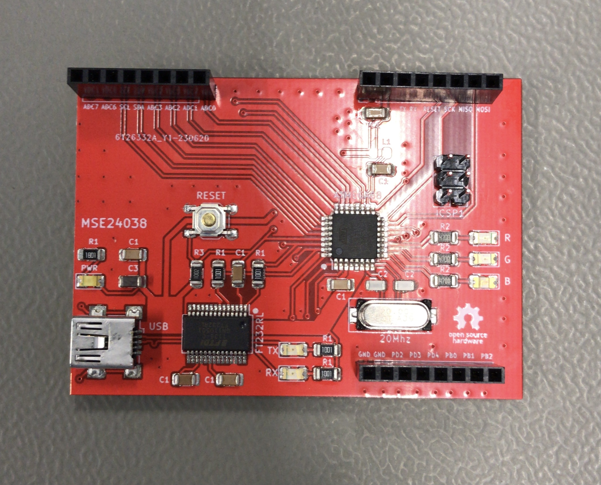
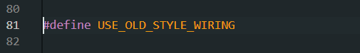
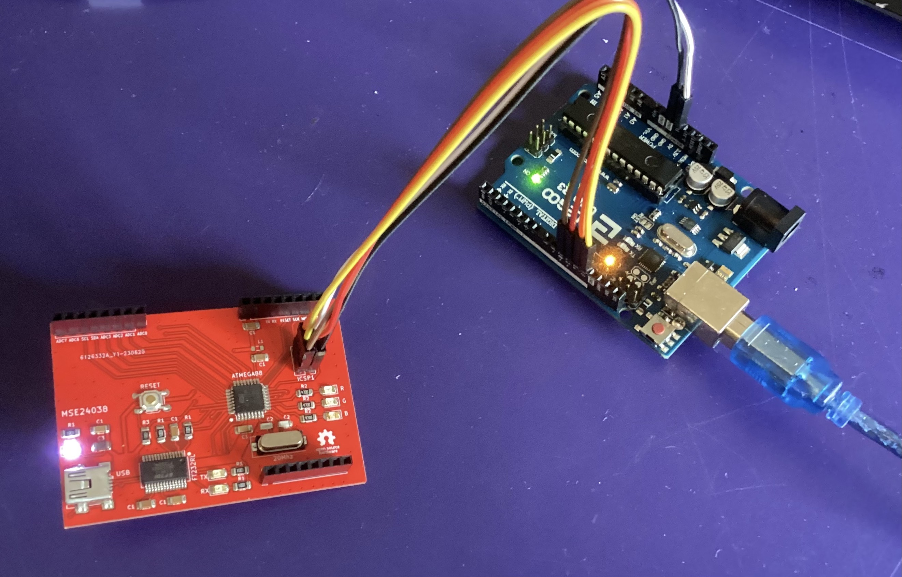
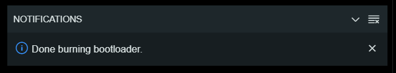

# Bare_Min_Atmega328p
PCB designed for available in-house parts. Made for testing the fab house, lab capabilities, and USB to UART.





# Assembly

Silkscreen is simplified for hand assembly hence the minimum amount of different values and the same names for many parts;
 ```ignore
 | Resistor |  Capacitor   | Inductor    |    LED                  |
 |----------|--------------|-------------|-------------------------|
 | R1 = 1k  | C1 = 100nF   |  L1 = 10uH  | PWR = White             |
 | R2 = 470 | C2 = 22pF    |             | R/G/B = Red/Green/Blue  |
 | R3 = 10k | C3 = 10uF    |             | RX/TX = Orange          |

 ```


Tip: 
R1 next to the PWR led should be more than 1k unless you want it to always be too bright, I recommend 1k8 or 2k2.

# Programming
1. Open in Arduino IDE File/Examples/11.ArduinoISP/ArduinoISP.
2. Uncomment line 81 (// #define USE_OLD_STYLE_WIRING).



3. Upload the code to your Arduino Uno with Board: Arduino Uno, Programmer: AVRISP mkII.
4. Connect Arduino Uno with the custom board like so:
 ```ignore
 | Uno      |  Custom Board| 
 |----------|--------------|
 | 10       | RESET        |  
 | 11       | MOSI         | 
 | 12       | MISO         |  
 | 13       | SCK          |
 | 5v       | 5v           |
 | GND      | GND          |
 ```


5. Burning the bootloader steps. In Tools set Board: Arduino Duemilanove or Diecimila, Programmer: Arduino as ISP, then click Burn Bootloader.


6. You should see "Done Burning Bootloader". Now you're set and can unplug your jumper wires and store your Arduino Uno you won't need it anymore.



7. Connect your custom board to your PC through a USB cable.
8. In order to upload any code just select in Tools Board: Arduino Duemilanove or Diecimila, Programmer: AVRISP mkII, and click Upload (arrow pointing right). You should see the orange LEDs flashing.
9. If you want to start with the blink sketch make sure to use pins 5,6 or 7 because built-in LED's are on those pins.
 ```ignore
 | PIN      |  LED        | 
 |----------|-------------|
 | PD7      | RED         |  
 | PD6      | GREEN       | 
 | PD5      | BLUE        |  
 ```


# *Disclaimer*

This board has no defined purpose it was made for testing the ordering process, the lab assembly capabilities, and USB to UART. 
Additionally, it was designed for the preexisting available components that were lying around the lab. Hence the part selection is suboptimal.


